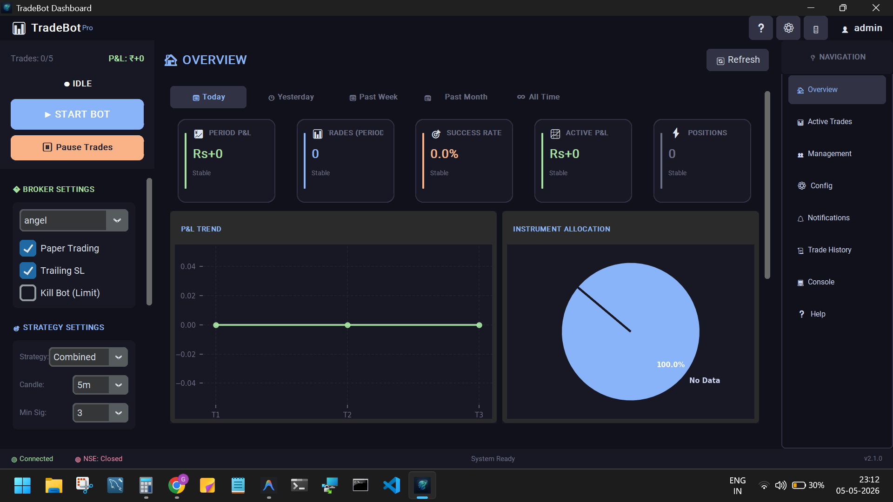
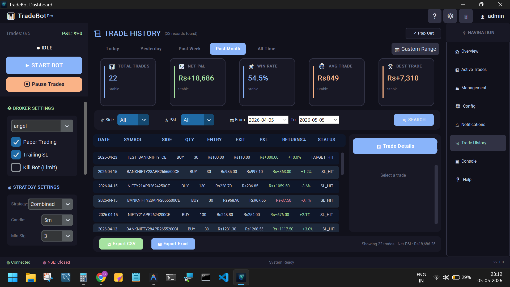

# TradeBot: Automated Systematic Trading & Risk Management Platform

A sophisticated algorithmic trading system designed for the Indian equity derivatives market (Nifty, BankNifty). This project focuses on eliminating emotional bias and enforcing strict risk-reward discipline through automated execution.

## 📸 Interface Preview
| Overview Dashboard | Trade History & Metrics |
|---|---|
|  |  |

| Strategy Configuration | 
|---|
|  | 

## 📊 Strategic Core
- **Logic:** Multi-indicator confluence (EMA, RSI, Breakout) combined with ATR-based volatility analysis.
- **Decision Engine:** 3-tier signal validation system with "RSI Exhaustion Guards" to prevent buying at extreme overbought levels.
- **Risk Control:** Hard P&L stops, 6-level Trailing Stop Loss ladder, and automated EOD position squaring.

## 📁 Project Contents
- **/docs**: Detailed daily performance reports showing the bot's logic and "Safety Block" events.
- **ARCHITECTURE_REVIEW.md**: Deep dive into the system's structural design and risk modules.
- **alpha_blueprint.md**: The strategic roadmap and mathematical foundation of the trading logic.

## 🛡️ Risk Management Features
- **Max Daily Loss Limit:** System-wide hard stop to preserve capital.
- **Dynamic Trailing SL:** Protects unrealized profits during high-momentum moves.
- **Safety Blocks:** Automated prevention of entries during news spikes or RSI exhaustion.

---
*Note: The source code is maintained in a private repository to protect proprietary trading strategies. Live performance demos and code walkthroughs are available upon request during interviews.*
